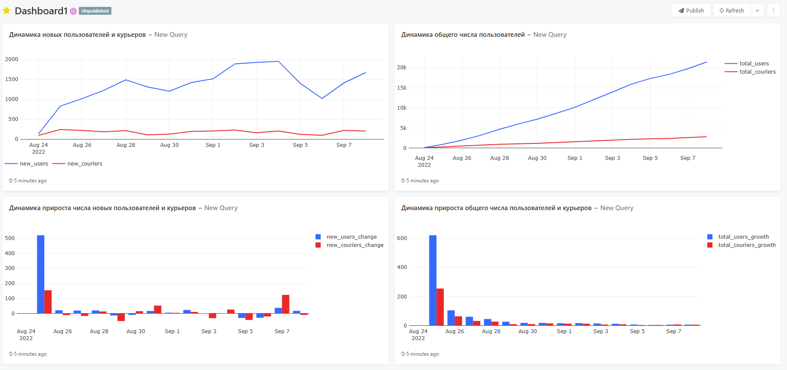
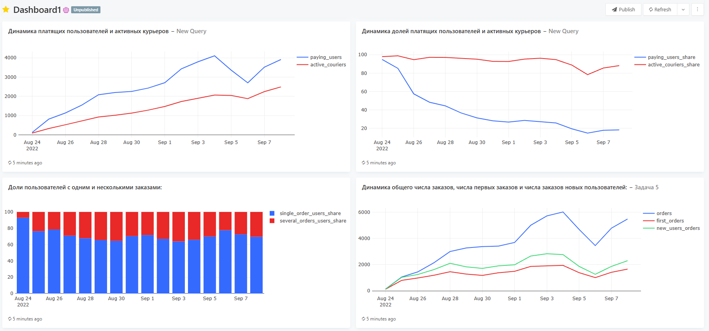
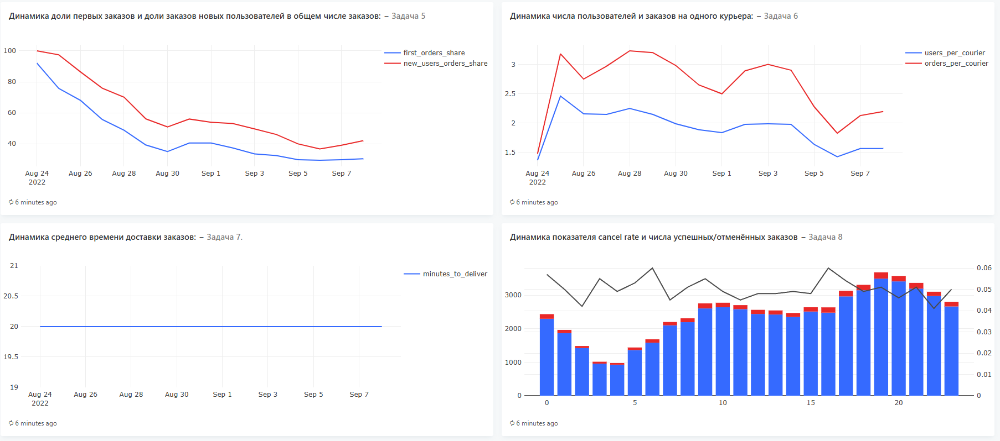
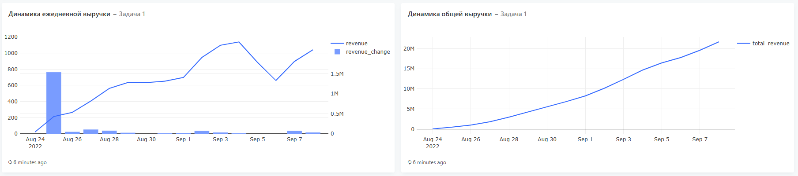
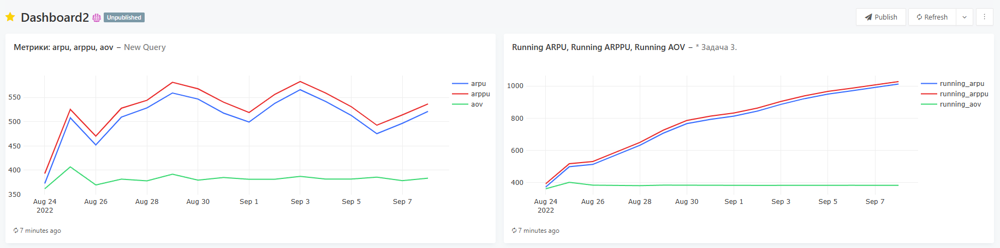

# SQL / Redash Dashboard (Karpov.Courses) — учебный проект

Учебный проект по продуктовой аналитике, выполненный в **Redash** на основе SQL-запросов  
в рамках обучения на платформе **Karpov.Courses**.

Дашборд собран в учебной среде Redash, доступ к базе данных и подключениям воспроизвести локально нельзя.  
Проект оформлен в виде портфолио: описание логики, метрик и визуализаций.

## Используемые метрики и логика расчётов

- **New Users / New Couriers** — количество новых пользователей и курьеров за день  
- **Paying Users** — пользователи с хотя бы одним успешным заказом  
- **ARPU** — выручка / общее число пользователей  
- **ARPPU** — выручка / число платящих пользователей  
- **AOV** — средний чек  
- **Cancel Rate** — доля отменённых заказов  
- **Orders per Courier** — среднее число заказов на одного курьера  

## Примеры визуализаций

### Рост пользователей и курьеров

### Платящие пользователи и активные курьеры

### Заказы и первые заказы

### Выручка

### Продуктовые метрики (ARPU / ARPPU / AOV)

